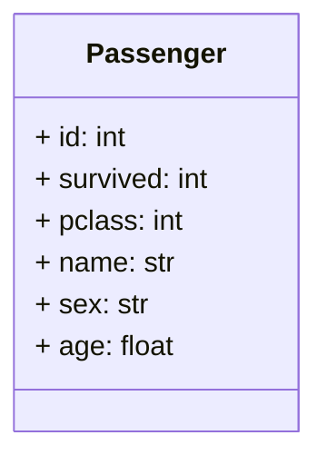

# Cours sur les Générateurs et les Sémaphores en Python


## Introduction


Les générateurs sont des structures puissantes en Python qui permettent de créer des **séquences** de valeurs de manière efficace. 
> [!TIP]
> Ils sont particulièrement utiles lorsque vous devez travailler avec de grandes quantités de données, 
> car ils génèrent des valeurs à la demande plutôt que de les stocker en mémoire.

## 1. Les Fonctions Génératrices

1. Définition

Une fonction génératrice est une fonction Python qui utilise l'instruction **yield** pour produire une séquence de valeurs. Lorsqu'une fonction génératrice est appelée, elle retourne un objet générateur, mais ne commence pas réellement l'exécution de la fonction jusqu'à ce que la méthode next() du générateur soit appelée.


1. Exemple

```python
def gen_numbers(n):
    for i in range(n):
        yield i

# Utilisation
gen = gen_numbers(5)
print(next(gen))  # Affiche 0
print(next(gen))  # Affiche 1
print(next(gen))  # Affiche 2
# ...
```

## 2. Avantages des Générateurs

1. Économie de Mémoire

> [!TIP] 
> Les générateurs produisent des valeurs à la volée.
> Ce qui signifie qu'ils n'occupent pas autant d'espace mémoire que les > > structures de données classiques, comme les listes.

1. Évaluation Paresseuse

Il calcule les valeurs qu'au fur et à mesure de leur demande.

Cela améliore les performances et permet de travailler **avec des ensembles de données potentiellement infinis**.

1. Compréhensions de Générateurs
   
Les compréhensions de générateurs sont une syntaxe concise pour créer des générateurs.

```python
gen = (x**3 for x in range(1_000))
for num in gen:
    print(num, end=", ")
```

## 3. Utilisation Avancée

1. Passer des valeurs aux générateurs.
   
Les générateurs peuvent également recevoir des valeurs lors de l'appel en utilisant la méthode **send().**

1. Comprendre le passage de valeur(s) avec la méthode send.

```python
def gen():
    yield 1
    yield 2
    yield 3

# création du générateur 
g = gen()

# consomme un itérateur
g.send("test")
# retournera 1
```

```python
def gen():
    recieved = yield
    print(recieved)
  
try:
    g = gen()
    next(g) # initialise le générateur
    g.send("test") # on déclenche une nouvelle itération il n'y a plus de yield mais print s'exécute et affiche la valeur passée au yield 
except StopIteration:
    pass
```

## 01 Exercice générateur multiplicateur

Créez un générateur qui multiplie chaque nombre généré par un facteur spécifié, ci-dessous un générateur de 2 * 3 à 10.

```txt
# résultat du générateur
res : 6
res : 18
res : 54
res : 162
res : 486
res : 1458
res : 4374
res : 13122
res : 39366
res : 118098
```

## 4. Gestion des exceptions

Les générateurs peuvent lever des exceptions à l'aide de l'instruction **raise** dans la fonction génératrice. Les exceptions peuvent être capturées lors de l'appel de la méthode next().

```python
def gen():
    yield 1
    yield 2

try:
    gen = gen()
    while True:
        value = next(gen)
except StopIteration as e:
    print("stop")
```

## 01.1 Exercice Itérator

La notion proche des générateurs est la notion d'iterateur que l'on peut égelement définir avec une classe et des méthodes spéciales :

```python
class IterNumber:
    
    def __iter__(self):
        pass 
    
    def __next__(self):
        pass 

# On itère sur la classe IterNumber
for e in IterNumber():
    pass
```

1. Créez son itérateur qui retourne des nombres affectés par un coefficient de réduction.

```python
IterNumber(coeff = .01, numbers = [91, 11, 100, 3938])
```

## 02 Exercice titanic

1. Affichez uniquement les femmes de moins de 41 ans qui ont survécu sur le Titanic, pour se faire utiliser le module csv de Python.

```python
import csv

# lecture d'un fichier 
with open("./Data/titanic.csv", 'r') as csv_file:
    spamreader = csv.reader(csv_file, delimiter=',', quotechar='|')
```

1. Trouvez une méthode simple pour afficher le nombre de personne(s) qui répondent aux critères

1. Créez une classe Passenger, comme suit, avec ses getter et setter Python, nettoyez les données pour les champs suivants : Survived, Sex et Age.

Nous allons revoir la notion de classe dans la suite du cours.

```python
class Passenger:
    def __init__(self, id, survived, sex, age ):
        pass
```

- Schéma des données

