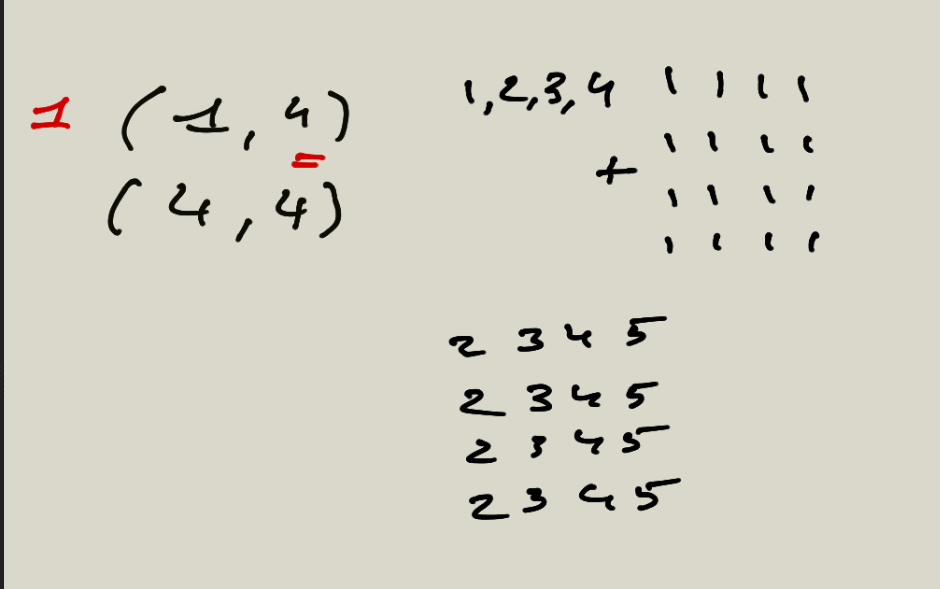
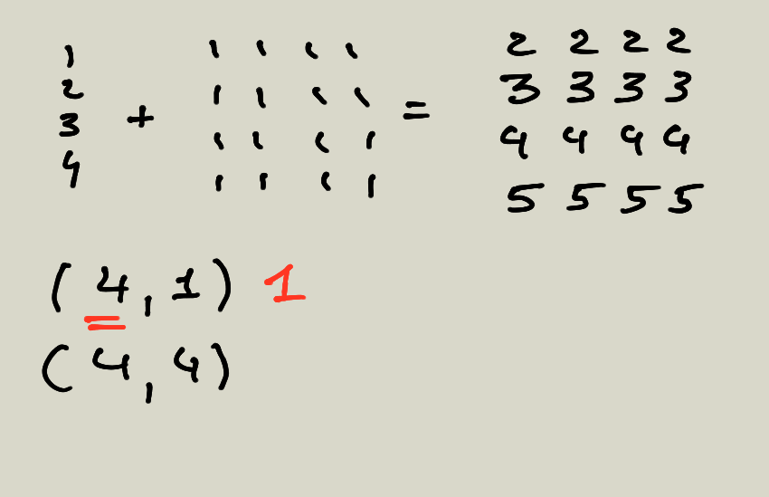
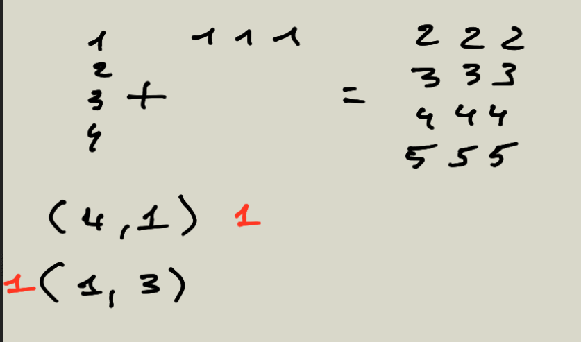

## 13 Broadcasting

### 13.1 Introduction

La notion de broadcasting sera à appliquer à des tableaux de 1 à 2 dimensions dans ce cours. Il peut s'appliquer à des tableaux de plus grande dimension, mais dans ce cas il est plus difficilement compréhensible.

Si on considère deux tableaux a et b suivant :

```python
import numpy as np

a = np.array([1,2,3], dtype='int8')
b = np.array([4,5,6], dtype='int8')

```

On peut les additionner ou les multiplier :

```python
print( a + b )
# array([5, 7, 9])
print( a*b )
# array([4, 10, 18]])
```

Numpy additionne ou multiplie terme à terme les valeurs des deux tableaux.

Dans l'exemple suivant Numpy propage la valeur 2 au tableau a :

```python
c = np.array([2], dtype='int8')

print(a + c)
# array([3, 4, 5], dtype=int8)
print(a*c)
# array([2, 4, 6], dtype=int8)
```

### 13.2 Tableau à 2d

Lorsque vous allez multiplier, additionner, ...Deux tableaux de dimension 2 vous devez appliquer la règle suivante :

**Les dimensions en partant de la droite doivent être soit égales, soit l'une des deux doit être égale à 1.**

Prenons l'exemple suivant, un tableau de dimension (1,4) et (4,4)

```python

a = np.array([1,2,3,4])
b = np.ones((4,4))

```

Si on calcule les dimensions de ces deux tableaux la règle du broadcasting est vérifiée :

```python
a.shape
#(1,4)
b.shape
#(4,4)
```

Nous pouvons dès lors utiliser les opérateurs arithmétiques classiques sur ces tableaux :

```python
# Voir les valeurs a et b précédentes.
print( a + b )
```



\newpage

Voici un autre exemple, on a un tableau de dimension (1, 4) avec un tableau (4,4) :



\newpage

Voici maintenant un dernier exemple avec un tableau de dimension (4, 1) et (1, 3). Le résultat du broadcasting sera un tableau de dimension (4, 3).

```python

a = np.array([1,2,3,4]).reshape(4, 1)
b = np.ones((1,3))


print(a+b)
```


