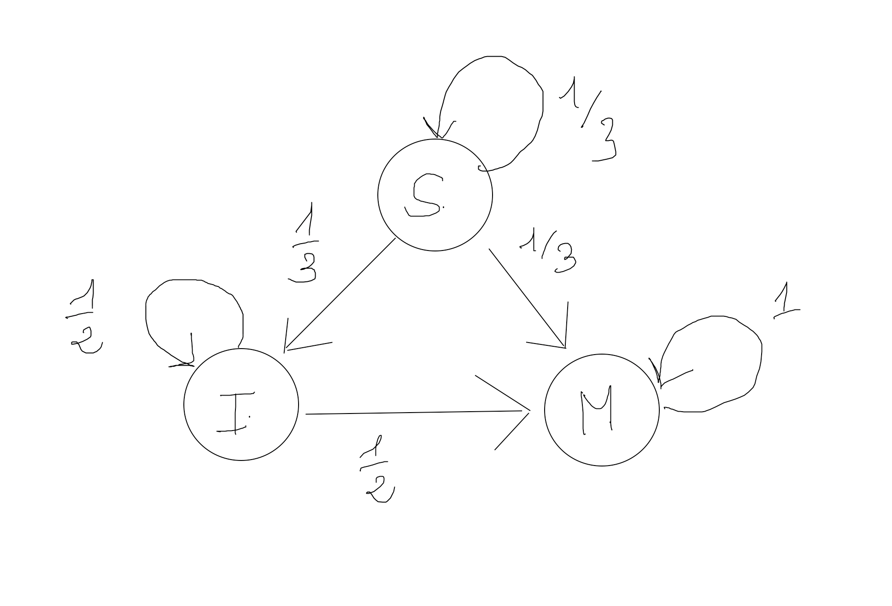

# Listes d'exercice

## 14. liste d'exercices supplémentaires

### Exercice diagonale

Soit un tableau v de dimension (1, n). Créez une fonction matDiag qui crée une matrice m diagonale de taille $n \times n$ tel que :

$m{i,i} = v_i$ et $m_{i, j} = 0, i \neq j$

### Exercice compter

Récupérez le fichier input.txt dans les sources.

1. Créez un tableau Numpy de dimension (30, 1) constitué des lignes du fichier.

2. Créez un dataset qui comportera un tuple (pattern, count) où respectivement pattern est une ligne du fichier et count le nombre d'occurence du symbole 'X' dans la ligne.

3. Ordonnez le dataset par ordre croissant du nombre de symbole 'X'.

### Exercice créer une matrice tri-diagonale & spéciale

13.1 Créez une fonction qui prend un entier n et qui permet de créer une matrice tri-diagonale de taille $n \times n$ :

$$\begin{pmatrix}
       1 &  1     &          &    0    \\
       1 & \ddots &  \ddots  &         \\
         & \ddots  &         &      1   \\
       0  & \ddots  &     1    &    1   \\
\end{pmatrix}$$

13.2 Créez maintenant une fonction **createSpecialMat** qui prend un entier $n \geq 1$ et renvoie une matrice de dimension n formée sur le modèle suivant, exemple avec $n=4$ :

$$\begin{pmatrix}
 1 & 2 & 3 & 4 \\
 2 &  1 &  2 &  3 \\
 3 &  4 &  1 &  2 \\
 4 &  5 &  6 &  1 \\
\end{pmatrix}$$

### Exercice pourcentage de pollution

Récupérez le dataset dans les sources "pollution_2016.csv". Utilisez la fonction np.loadtxt pour récupérer les données dans Numpy.

Affichez le nom du pays et le pourcentage du pays qui a le plus fort taux de pollution.

### Exercice séquences circulaires

Créez une fonction circular qui prend en paramètre un entier n et renvoie une matrice de taille n*n et calcule toutes les permutations circulaires du cycle de longueur n, voyez l'exemple ci-dessous :

```python

circular(10)

"""
[[ 1  2  3  4  5  6  7  8  9 10]
 [ 2  3  4  5  6  7  8  9 10  1]
 [ 3  4  5  6  7  8  9 10  1  2]
 [ 4  5  6  7  8  9 10  1  2  3]
 [ 5  6  7  8  9 10  1  2  3  4]
 [ 6  7  8  9 10  1  2  3  4  5]
 [ 7  8  9 10  1  2  3  4  5  6]
 [ 8  9 10  1  2  3  4  5  6  7]
 [ 9 10  1  2  3  4  5  6  7  8]
 [10  1  2  3  4  5  6  7  8  9]]

"""

```

### Exercice matrices probabilistes

Dans un village une nouvelle maladie contagieuse non mortelle fait son apparition. Les individus de cette ville sont dans l'un des trois états suivants :

1. S l'individu est sain (non malade et non infecté).
2. I l'individu est sain mais infecté.
3. M l'individu est malade.

Un seul individu est à l'origine de la maladie sur les 100 personnes que compte la population totale. De plus l'état de chaque individu change selon le schéma suivant :

- Parmi les individus sains la proportion des individus qui deviennent porteurs sains est égale à 1/3 et 1/6 ceux qui deviennent malades.
- Parmi les individus porteurs sains la proportion des individus qui deviennent malades est 1/2.



\newpage

On peut représenter la situation ci-dessus à partir d'une matrice P :
$P_{n+1}=P_n \times A$

1. Exprimez la matrice A du graphe ci-dessus en Numpy ainsi que le vecteur initial représentant l'état probabiliste de la maladie.

2. Créez une fonction **Pn** qui prend deux paramètres : v et A respectivement l'état précédent et A la matrice du graphe. Cette fonction retourne un vecteur probabiliste de dimension (3,)

3. Vérifiez par le calcul pour les 4 premières semaines que $P_4 = P_0*A^4$.

4. Quelle est la probabilité qu'un individu soit sain au bout de 4 semaines ?

5. On vaccine la population au bout de la quatrième semaine on a alors la matrice b suivante :

```python
b =  np.array([
    [ 5/12, 1/4, 1/3 ],
    [ 5/12, 1/4, 1/3 ],
    [ 1/6, 1/2, 1/3 ],
])
```

Dans la suite on exprimera l'état suivant : $Q_n = Q_0 \times b$

6. Exprimez sous forme vectorisée les états suivants : $s_5, i_5, m_5$.

7. Créez une fonction **nextProba** pour les probabilités suivantes $s_n, i_n et m_n$.
Notez que $P_4=Q_0$.

8. Calculez nextProba(2), nextProba(3), ... Que pouvez-vous en déduire sur l'état d'évolution de la maladie dans le village ?

### Battle

La première partie de ce tp ne nécessite pas Numpy.

### Première partie

Vous allez développer le jeu de carte de la bataille avec deux joueurs. Implémentez ce jeu en créant deux classes : Game qui contiendra la logique du jeu et Card qui représente une carte du jeu. Pour cet exercice on vous donne un fichier de données card.txt que vous trouverez dans les sources. Utilisez ce format de données pour les cartes dans l'exercice.

Lorsqu'il y a bataille, vous retirerez ces cartes aux deux joueurs.

### Deuxième partie

Répétez le jeu un grand nombre de fois et analysez les différentes parties avec le plus de critères possibles en utilisant Numpy.
