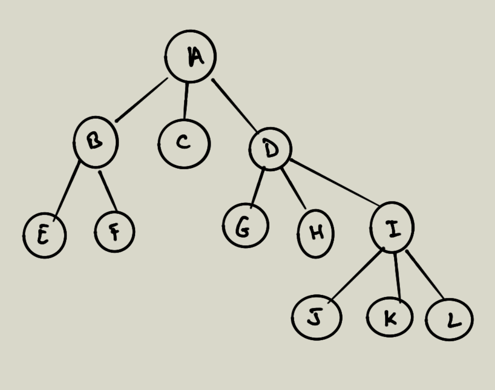

# Algorithmique

## Exercice recherche de relations

Ci-dessous une matrice d'adjacence.

```python
import numpy as np

## Exercice 1

g1 = np.array([
       [1, 1, 1, 1, 1, 1, 1, 1, 1, 0],
       [0, 0, 0, 0, 0, 0, 0, 1, 0, 0],
       [1, 1, 1, 1, 1, 1, 0, 0, 1, 1],
       [0, 1, 0, 0, 1, 0, 0, 1, 0, 1],
       [1, 1, 1, 0, 0, 0, 1, 0, 1, 0],
       [0, 0, 1, 0, 0, 1, 0, 0, 1, 0],
       [0, 0, 0, 1, 0, 0, 1, 0, 1, 1],
       [0, 1, 0, 0, 1, 0, 1, 0, 0, 1],
       [0, 1, 0, 1, 0, 0, 1, 0, 1, 1],
       [1, 1, 1, 1, 1, 1, 0, 0, 1, 0]
    ])

```

Dans la matrice ci-dessus, un sommet est représenté par un ligne. Cette matrice
représente les intérêts que des personnes peuvent avoir l'une pour l'autre. Il y a 
parfois réciprocité.
Si (l,c) vaut 1 alors cette personne est intéressée
par la personne (c,l), il y a réciprocité dans la relation d'intérêt si (c, l) vaut 1.

- Cherchez toutes les réciprocités du tableau pour former les couples de personne(s)
qui partage un intérêt réciproque.

## Exercice parcours en profondeur
# Graphe parcours

## Représentation d'un graphe

Ici on ne parle par de graphe orienté.

On peut utiliser un dictionnaire pour représenter un graphe, attention à la manière dont on implémente le graphe. Dans un dictionnaire il n'y pas de notion d'ordre. Les clés ci-dessous ne sont pas ordonnées dans le dictionnaire. Par contre les listes sont ordonnées.

Ci-dessous on définit

```python

graph = {
    'A' : [ 'B', 'C', 'D' ],
    'B' : [ 'E', 'F' ],
    'D' : [ 'G', 'H', 'I'],
    'I' : [ 'J', 'K', 'L']
}

```

Le parcours en profondeur est basé sur une pile, elle permet en dépilant d'explorer le graphe dans le sens de la profondeur. Le parcours en largeur est basé sur une queue premier entré, premier sorti permet de parcourir dans la largeur le graphe.

## Parcours en profondeur

On commence avec un noeud donné puis on explore chaque branche complètement avant de passer à la suivante. On peut dire que l'on explore à fond un noeud avant de passer au suivant. On va au plus profond dans le graphe

On peut implémenter le parcours de manière itérative ou récursive. Voyez d'abord une manière itérative.

Ci-dessous le graphe que l'on utilise dans l'exercice :



\newpage

## Exercice parcours en largeur

Maintenant que vous avez vu le parcours en profondeur, vous allez implémenter le parcours en largeur d'un graphe.

Implémentez une fonction qui prend un graphe et un sommet et qui parcours en partant du sommet chaque fils en largeur, avant de passer au noeud fils suivant.

## Exercice les triplets d'amis

```python
g = np.array([
    [0, 1, 0, 1, 0],
    [1, 0, 1, 0, 1],
    [0, 1, 0, 1, 0],
    [1, 0, 1, 0, 1],
    [0, 1, 0, 1, 0],
])

```

Trois personnes sont des amis si ces trois personnes sont reliées dans un graphe.

- Créez une fonction qui s'appliquera sur le graphe g et testera si (1,2,3) est un triplet d'amis.

- Créez une autre fonction qui testera si un triplet (a,b,c) sont étrangés, c'est-à-dire non relié dans le graphe.

- Créez une fonction qui permet maintenant de trouver tous les triplets (a,b,c) parmi un graphe de 5 sommets.

- Puis cherchez tous les amis possibles dans la matrice ci-dessus.
