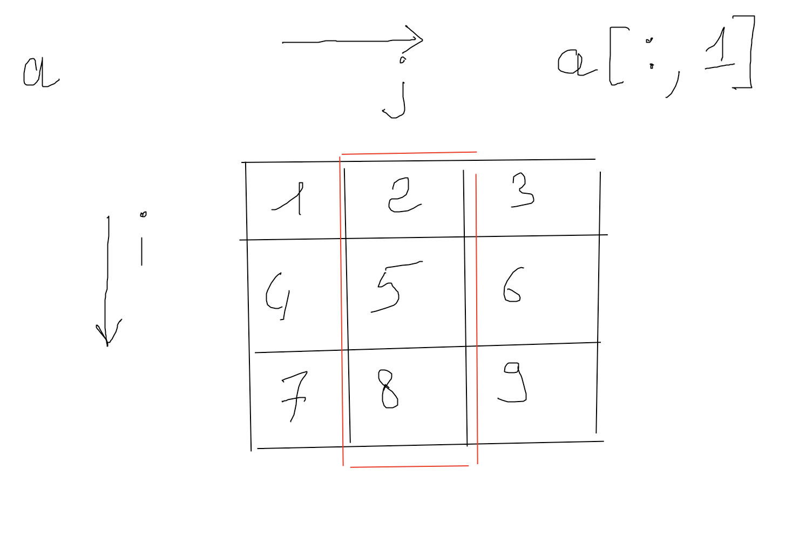
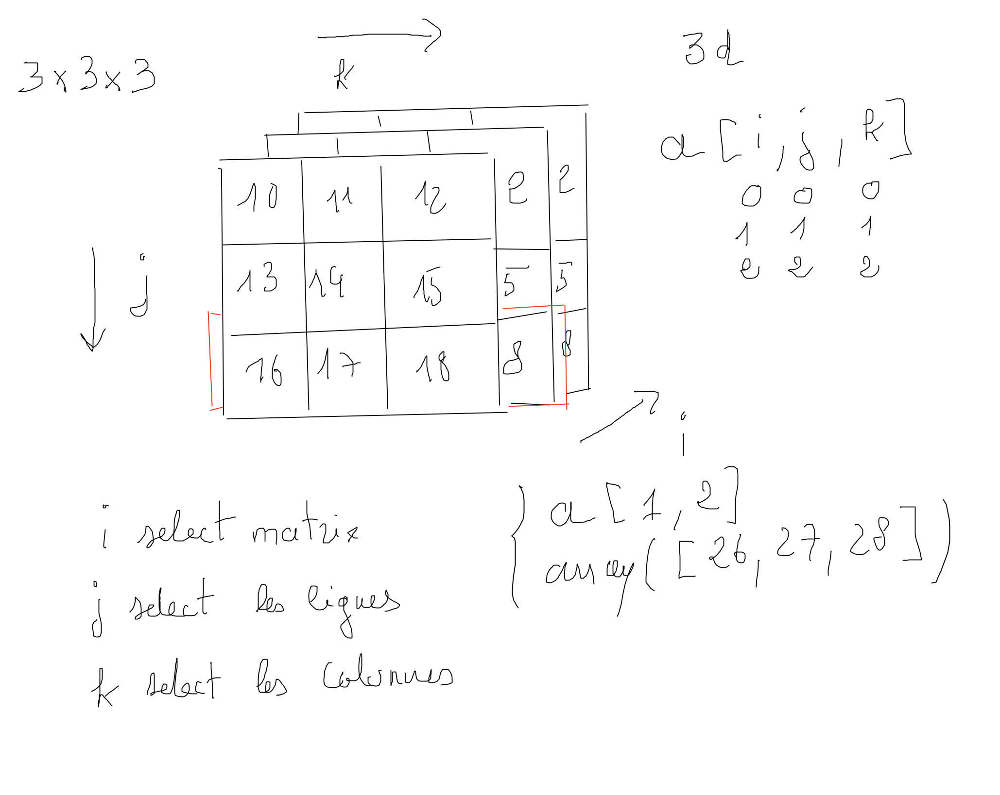

# Manipuler les arrays

## 7. Structure array définition et accès aux données

### 7.1 Accèder/modifier un/des élément(s) d'un tableau

Un tableau Numpy est **mutable**, on peut donc modifier son contenu en lui assignant d'autre(s) valeurs. Mais attention vous ne pouvez pas en ajouter.

```python
x[0,1] = 100
```

Pour un tableau d'une dimension l'accès aux données d'un tableau Numpy se fait comme pour les listes classiques que vous avez déjà vues dans le cours Python.

Quelques exemples :

```python
# creation d'un tableau 2 lignes 3 colonnes
# avec des valeurs aléatoires entières comprises entre 0 et 10
x = np.random.randint(10, size=(2,3))

# Accéder à une valeur, première ligne, première colonne
x[0,1]
```

Vous pouvez utiliser le slicing également pour accéder à des groupes de valeurs, notez bien que dans ce cas Numpy ne vous retourne pas un tableau supplémentaire, mais **une vue** du tableau :

```python
# la première colonne
x[:, 0]

# la première ligne
x[0,:]

```

Le slicing de Numpy crée donc la même référence pour un tableau :

```python

a = np.array( [ [1,2,3], [4,5,6] , [7,8,9]])

# à partir de la deuxième ligne
# à partir de la troisème colonne
b = a[1:, :2]
# array([[4, 5],[7, 8]])

a[1, 1] = 100

# même référence
print(b)
"""
array([[  4, 100],[  7,   8]])
"""
```

### Remarques importantes

Attention cependant, le type d'un tableau Numpy étant pré-défini, vous ne pouvez pas assigner dans ce tableau des valeurs d'un type différent.
Il n'existe pas de méthode append, en effet un tableau ne peut contenir plus de valeur(s) qu'il ne possède lors de sa création.

Exemple de tableau 2d :

```python
a = np.array([[1,2,3], [4,5,6], [7,8,9]])
```




### Exercice 

1. Calculez la somme des valeurs en colonne.
1. Calculez la somme des valeurs en ligne.
1. Calculez la somme des valeurs en diagonale.
1. Faites la somme des lignes paires.
1. Créez une nouvelle matrice en élimimant les lignes dont la somme est pair.

```python
data = np.array([[4, 3, 8, 5, 2, 2, 0, 1, 8, 6],
       [1, 7, 6, 2, 7, 0, 1, 6, 1, 1],
       [7, 2, 8, 0, 8, 2, 5, 8, 3, 7],
       [6, 5, 7, 8, 2, 2, 2, 9, 2, 3],
       [6, 4, 3, 6, 6, 6, 9, 5, 8, 2],
       [0, 2, 9, 0, 4, 5, 3, 4, 0, 1],
       [0, 3, 5, 1, 4, 6, 0, 4, 5, 6],
       [0, 3, 5, 7, 4, 9, 3, 7, 4, 8],
       [1, 3, 1, 2, 9, 4, 4, 9, 5, 4],
       [6, 5, 0, 0, 1, 7, 9, 0, 9, 5]])
```


### 7.2 les tableaux 3d

Dans un tableau 3d vous avez trois indices : i, j, k qui représentent respectivement :

- i la matrice

- j la ligne

- k la colonne

```python

a = np.array([
       [[10, 11, 12], [13, 14, 15], [16, 17, 18]], # matrix 0
       [[20, 21, 22], [23, 24, 25], [26, 27, 28]],
       [[30, 31, 32], [33, 34, 35], [36, 37, 38]]
])
```



Quelques exemples :

```python
# première matrice
# toutes les lignes
# deuxième colonne
print(a[0, :, 1])
# [11 14 17]

# toutes les matrices
# deuxième ligne
# troisième colonne
print(a[:, 1, 2]) 
# [15, 25, 35]

# toutes les matrices
# deuxième ligne
print(a[:, 1])
# [[13 14 15]
#  [23 24 25]
#  [33 34 35]]

# toutes les matrices
# toutes les lignes
# première colonne
print(a[:, :, 0])
# [[10 13 16]
#  [20 23 26]
#  [30 33 36]]
```
