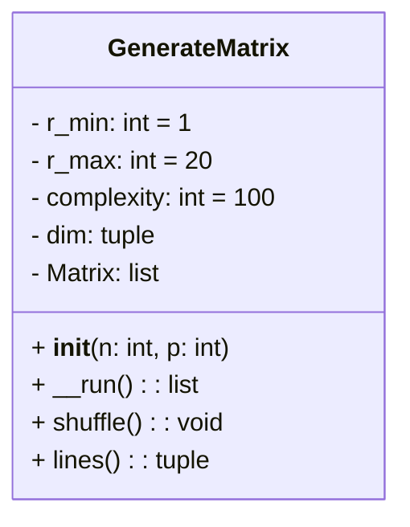

# Tests avec Pytest

## 01 Exercice Parser

Testez la classe Parser 

## 02 Exercice Calculator TDD

Pour la problématique suivane, vous allez la traiter en TDD.

1. Voici une chaîne de caractères avec des aditions uniquement, sans parenthèse. Créez une classe et une fonction qui fait la somme de ces valeurs.
   
1. Faites d'abord les tests avant d'implémenter la logique dans la classe métier.

```python
s = "5.5 + 10 + 30 + 13.7"
total # 59.2
```

## 04 Exercice fixtures de tests

```bash
pip install pytest-datadir
```

1. Automatisez les tests avec les données d'exemple dans le dossier data pour le test de la somme.

## 03 Exercice TDD

Créez un scénario de tests pour la classe GenerateMatrix, créez les tests avant d'implémenter la logique dans la classe; puis tester la classe , elle génère des matrices et possède une méthode pour mélanger les lignes de la matrice.



## 03 Exercice Calculatrice en notation polonaise inversé

1. Créez maintenent une classe qui effectue les opérations +, x et des parenthèses.

```python
s = "5.5 + 3*(10 + 30 + 13.7) "
```

## 04 Base de données 

Créez la base de données suivantes, puis testez celle-ci dans la partie tests de votre projet.

>[!NOTE]
>Pensez à installer sqlalchemy avec un **pip install sqlalchemy**

```python
from sqlalchemy import  Column, Integer, String, Sequence
from sqlalchemy.orm import registry

mapper_registry = registry()
Base = mapper_registry.generate_base()

class User(Base):
    __tablename__ = 'users'
    id = Column(Integer, Sequence('user_id_seq'), primary_key=True)
    name = Column(String(50))
    age = Column(Integer)
```
